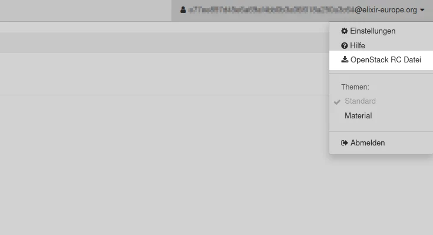
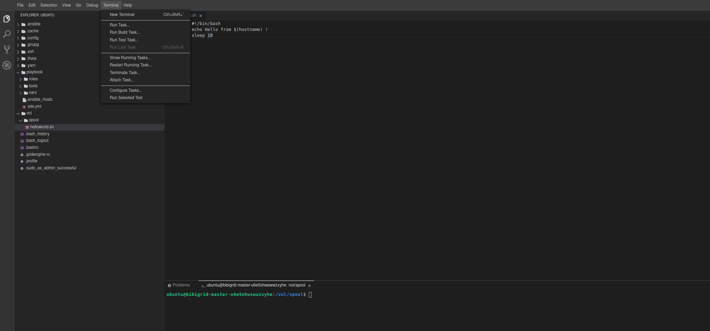

# de.NBI cloud user meeting 2021

## Setup of BiBiGrid

### Requirements

BiBiGrid is currently written in Java and needs a Java Runtime Environment Version 8 or greater installed. Future versions may largely be migrated to Python. Additionally a terminal client and an SSH client are needed.

### Download 
The easiest and recommended way to use BiBiGrid is to download the [latest prebuilt binary](https://bibiserv.cebitec.uni-bielefeld.de/resources/bibigrid/bibigrid-openstack-current.jar).  

### Build from Source
Alternatively, you may clone the [BiBiGrid repository](https://github.com/BiBiServ/bibigrid/) and build it yourself using Maven, which requires a Java Development Kit (>= 8) and Maven (>= 3.9) installed.

``` BASH
> git clone https://github.com/BiBiServ/bibigrid.git
> cd bibigrid
> mvn clean package -P openstack
```

### Credentials
BiBiGrid needs access to the Openstack API to work properly. 

#### Get API Access 

The access to the de.NBI Cloud sites' web-based user interface (Openstack Dashboard) is realized by an SSO mechanism using Elixir AAI. **An API password is not set by default.**

#### Download OpenStack RC file 

The OpenStack RC file is a file that contains the environment variables necessary to run OpenStack command-line clients. The file contains project-specific environment variables and allows access to the Openstack API. After login into the OpenStack Dashboard you can download the *OpenStack RC File v3*  by clicking on your account symbol in the upper right corner.  

  

After downloading, open up a terminal and source the downloaded file (e.g. clum2021-openrc.sh) to get the credentials into your environment.  

```BASH
> source RC_FILE.sh
```
  
_Note: You have to source the RC file in **every new terminal** to be able to access the OpenStack API._  

_Note: Application credentials are unfortunately not an option, because Openstack4J - the library used by BiBiGrid to talk with OpenStack - does not support them._

### Configuration

The prefilled configuration template below works on the de.NBI cloud site Bielefeld (verified on 2020-10-05). You have to adjust many of the values when trying this on other de.NBI cloud sites.

#### Template

```YAML
#use openstack
mode: openstack

#Access
sshUser: ubuntu
region: Bielefeld                            
availabilityZone: default                         

#Network
subnet: XXXXXX                                     # REPLACE

# Master instance
masterInstance:
  type: de.NBI default + ephemeral
  image: e4ff922e-7681-411c-aa9b-6784390a904e
  
# Worker instances
workerInstances:
  - type: de.NBI small + ephemeral 
    image: e4ff922e-7681-411c-aa9b-6784390a904e
    count: 3 
useMasterWithPublicIp: yes
useMasterAsCompute: no

#services
nfs: yes
zabbix: yes
slurm: yes

ideConf:
  ide: true
  
zabbixConf:
    admin_password: XXXXX                          # REPLACE
``` 

1. [Download](configuration.yml) the prefilled configuration template
2. Open it with an editor of your choice and replace the **XXXXXXX** values for `subnet` and `zabbixConf.admin_password`

#### Access
BibiGrid creates a new SSH key pair (stored at `~/.bibigrid/keys`) for each cluster started. These cluster specific keys are used to connect to the master instance. It is possible to add additional SSH keys for communication with the remote compute system (not covered by our template above, see BiBigrid documentation for a precise description).

#### SSH user
The ssh-user depends on the cloud image your cluster is based on. Since we run on top of Ubuntu 18.04 the ssh-user is `ubuntu`.

#### Region
The region can be determined easily by running the OpenStack CLI.

```bash
$ openstack region list
```

#### Availability Zone
The availability zone where your instances are created.

```bash 
$ openstack availability zone list
```

#### Network
If you have the permissions to create networks, BiBiGrid offers the possibility to create a new private network connected to an existing router. For our tutorial we work on an existing subnet. Please determine the subnet name or ID using the CLI.

```BASH
$ openstack subnet list
```

#### Instances
We would like to use a default Ubuntu 18.04 operating system image for our tutorial. Determine the ID of it using the CLI ...

```BASH
$ openstack image list
```

... and add it to the master/worker configuration.


#### Services
We use a typical cluster configuration for our workshop setup. That means we have to enable a shared fs (`nfs`), a grid batch scheduler (`slurm`), a monitoring framework (`zabbix`) and a web IDE (`theia`). 


### Creating a BiBiGrid alias
To keep the cluster setup process simple you can set an alias for the BiBiGrid JAR file installed before.  
The Unix command should look like the following (depending on the JAR filename):

```BASH
> alias bibigrid="java -jar /path/to/bibigrid-*.jar"
```

### Verify the Configuration
You can simply check your configuration using:

```BASH
> bibigrid -o configuration.yml -ch
```

### BiBiGrid commands - Start your first cluster
For information about the command set, you may now check the help command:  

```BASH
> bibigrid -o configuration.yml --help
```

Now we can create the first cluster with our previously generated configuration:  

```BASH
> bibigrid -o configuration.yml -c -v 
```

If no problem occurs, our cluster should be ready to work within about 15 minutes ... time for a coffee break

### <p align=center>--- 7 Minute Break ☕ ---</p>

It is possible to have more than one BiBiGrid cluster running simultaneously. List all running clusters (within the same OpenStack project) using:  

```BASH
> bibigrid -o configuration.yml --list
```

The command returns an informative list about all your running clusters.

### Good to know

#### SLURM
SLUM is an open source and scalable cluster management and job scheduling system for large and small Linux clusters. As a cluster workload manager, Slurm has three key functions. First, it allocates access to resources on the worker nodes to users for some duration of time so they can perform work. Second, it provides a framework for starting, executing, and monitoring work (normally a parallel job) on the set of allocated workers. Finally, it arbitrates contention for resources by managing a queue of pending work. (See [documentation](https://slurm.schedmd.com/) for a detailed documentation).

##### User Commands (partial list)

- `scontrol`: View and/or modify Slurm state
- `sinfo   `: Reports state of Slurm partitions and nodes
- `squeue  `: Reports the state of jobs or job steps
- `scancel `: Cancel a pending or running job or job step
- `srun    `: Submit a job for execution
- ...

#### Directory Structure
BiBiGrid establishes a shared filesystem (NFS) between all cluster nodes. The master acts as an NFS server and all clients connects to it.

- `/vol/spool` -> shared filesystem between all nodes.
- `/vol/scratch` -> local disk space (ephemeral disk, if provided)

## Log into the Cluster via direct SSH access

After a successful setup ...

```BASH
SUCCESS: Cluster has been configured. 
Ok : 
 You might want to set the following environment variable:

export BIBIGRID_MASTER=129.70.51.XXX

You can then log on the master node with:

ssh -i /Users/jkrueger/.bibigrid/keys/bibigridther0ysuts6vo37 ubuntu@$BIBIGRID_MASTER

The cluster id of your started cluster is: ther0ysuts6vo37

You can easily terminate the cluster at any time with:
bibigrid -t ther0ysuts6vo37 

```

... you should be able to log into the master node. Run `sinfo` to check if there are 3 workers available.

## Log into the Cluster through Theia IDE (more comfortable)

BiBiGrid offers a more comfortable way to work with your cloud instances using the web IDE [Theia](https://theia.org).
Let's see how this works together with BiBiGrid.



If the ide option is enabled in the configuration, theia will be run as systemd service on localhost. For security reasons, theia is not binding to a standard network device. A valid certificate and some kind of authentication is needed to create a safe connection, which is not that easy in a dynamic cloud environment.

However, BiBiGrid has the possibility to open a SSH tunnel from the local machine to BiBiGrid's master instance and to open up a browser window running Theia web IDE.

```bash
bibigrid -o configuration.yml --ide <cluster id>
```

### <p align=center>--- 7 Minute Break ☕ ---</p>

## Hello World, Hello BiBiGrid!

To see how the cluster with Slurm works in action, we start with a typical example : *Hello World !*

- If not already done, connect to your cluster (via terminal or web IDE) 

- Create a new shell script `hello-world.sh` in the spool directory (`/vol/spool`):

```
#!/bin/bash
echo Hello from $(hostname) !
sleep 10
```

- Open a terminal and change into the spool directory. 
`cd /vol/spool`


- Make our helloworld script executable:
`chmod u+x hello-world.sh`

- Submit this script as an array job 50 times: `sbatch --array=1-50 --job-name=helloworld hello-world.sh`
- See the status of our cluster: `squeue`
- See the output: `cat slurm-*.out`

## Monitoring your Cluster Setup
To get an overview about how your cluster is working, you can use *Zabbix* for monitoring.  
Therefore it is necessary to use port-forwarding in order to access the Zabbix server through your local browser.

Log into the cluster: 

```bash
ssh -L <local-port>:localhost:80 user@ip-address
```

As the `<local-port>` you have to choose a free port on your local system (e.g. `8080`).  
The `ip-address` is the public IP address of your master instance, that you received after cluster launch in the line `export BIBIGRID_MASTER=<ip-address>`.   Alternatively, you can use the `list` command from above to get an overview and copy the respective IP address in the row `public-ip`.

After you have successfully logged into your master instance, type `http://localhost:<local-port>/zabbix` into your browser address bar. Accordingly, it is the same `<local-port>` have chosen before.   
The public IP of your cluster should be visible with the list command `bibigrid -l` and is also displayed after setup.


You can log in with the `admin` user and the previously set admin password.

For a detailed documentation please visit the [Getting Started Readme](https://github.com/BiBiServ/bibigrid/blob/master/docs/README.md).


## Manual Cluster Scaling (NEW)
In some cases, you may want to scale down your cluster when you don't need all the worker instances or scale up when you need more of them.
We scale down one worker instance of our first worker batch previously configured.

```BASH
> bibigrid -o configuration.yml -sd <bibigrid-id> 1 1
```

Scaling down is quite fast, only the master node has to be reconfigured. Check the number of working nodes running `sinfo` on the master node. Since we need three workers for the 2nd part of this workshop we now scale up by one worker instance ...

```BASH
> bibigrid -o configuration.yml -su <bibigrid-id> 1 1
```

... and again check the number of worker nodes using `sinfo`. Scaling up takes some time (a few minutes) since newly added workers are being configured from scratch.


##  Using Ansible and running a bigger example

Ansible is used by BiBiGrid to configure all launched instances. It can also be used to modify an existing cluster.

-> [Ansible in a nutshell](https://gitlab.ub.uni-bielefeld.de/denbi/ansible-course)

## Terminate a Cluster

To terminate a running cluster you can simply use:

```bash
bibigrid -o configuration.yml -t <clusterid>
```

Optionally, it is possible to terminate more than one cluster appending the other IDs as follows:

```bash
bibigrid -o configuration.yml -t <clusterid1> <clusterid2> <clusterid3> ...
```

Another option is to terminate all your clusters using your username:

```bash
bibigrid -o configuration.yml -t <user>
```
